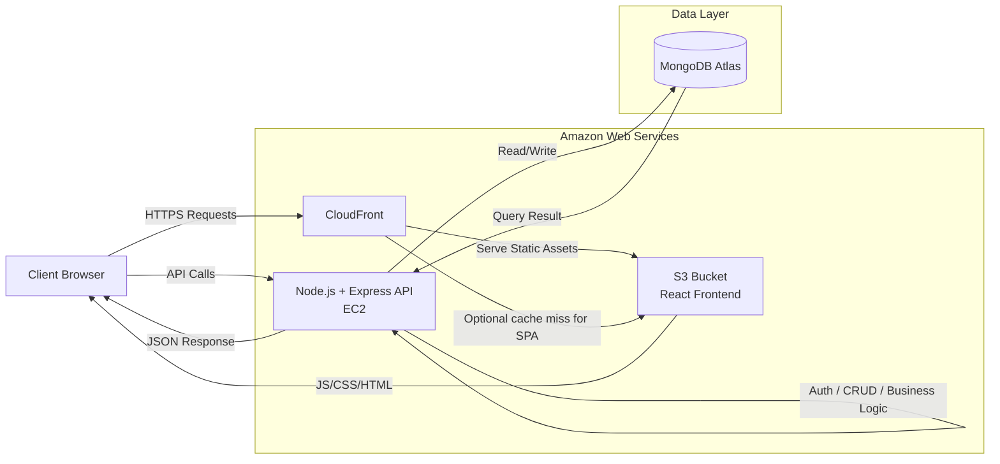
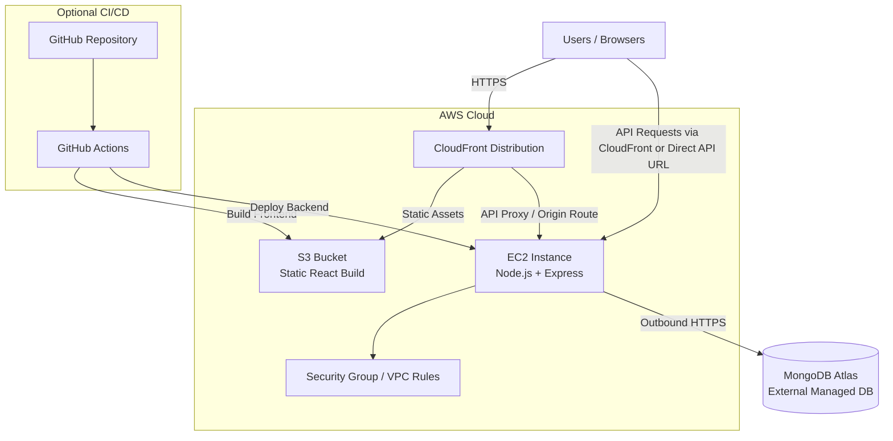
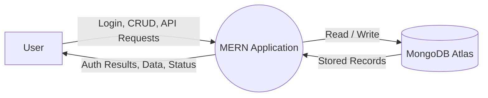
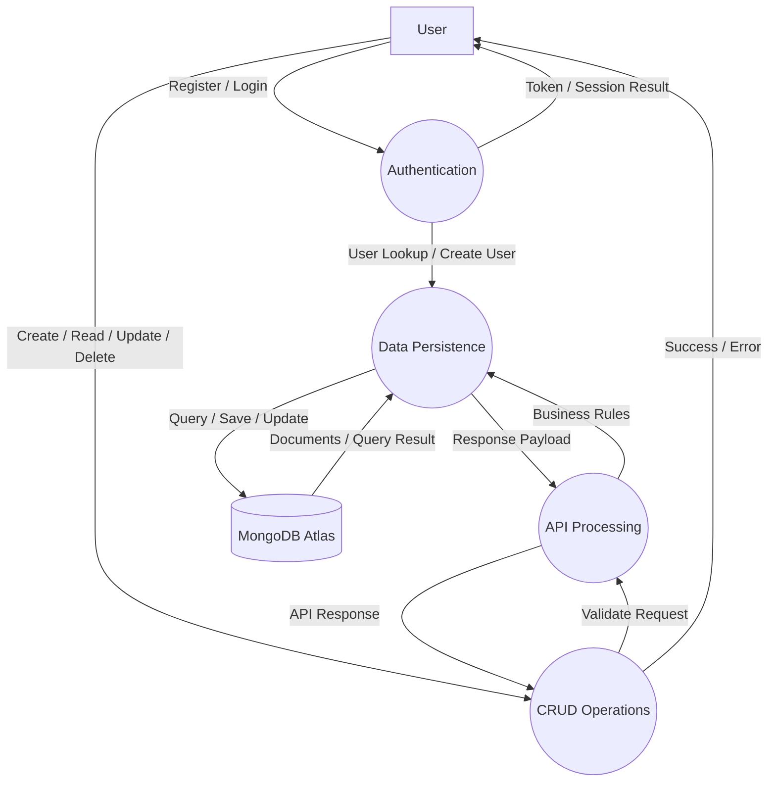
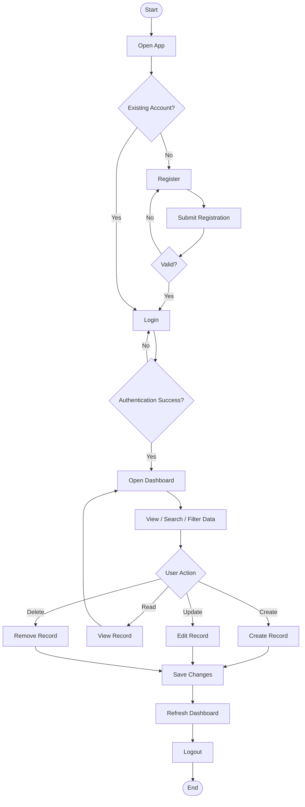
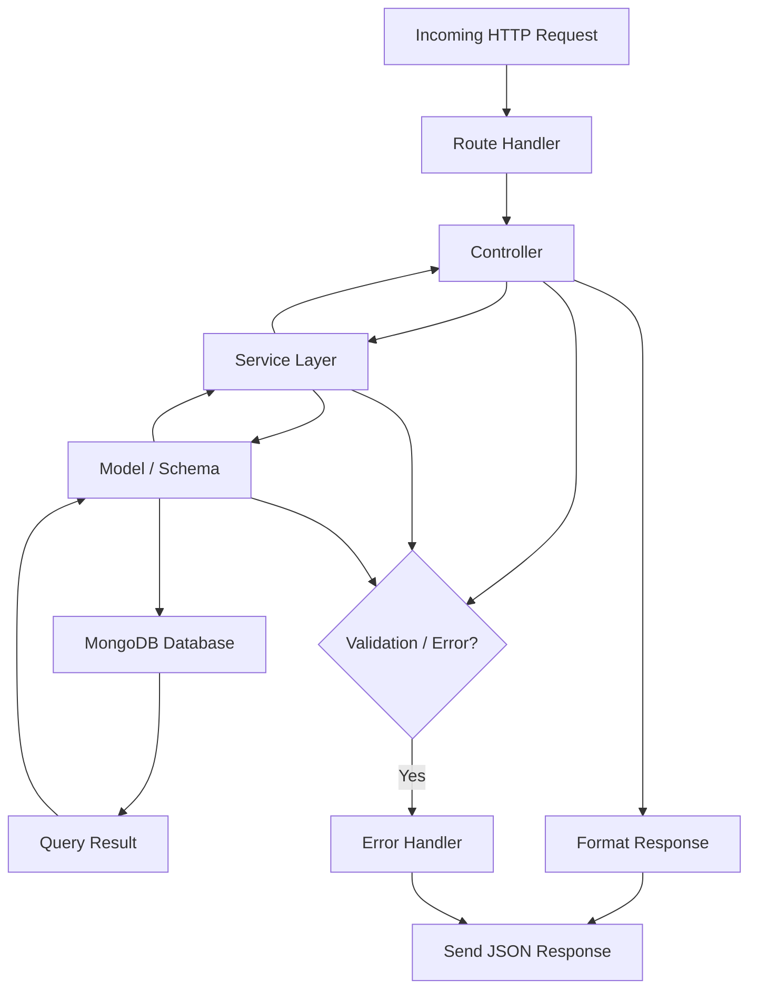
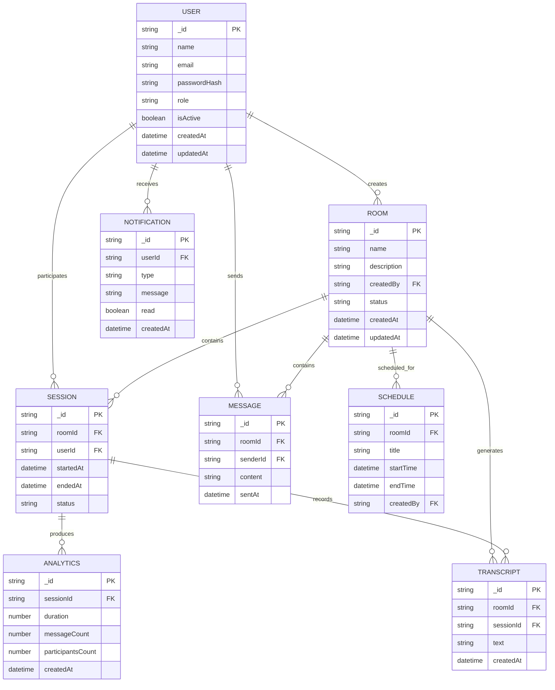
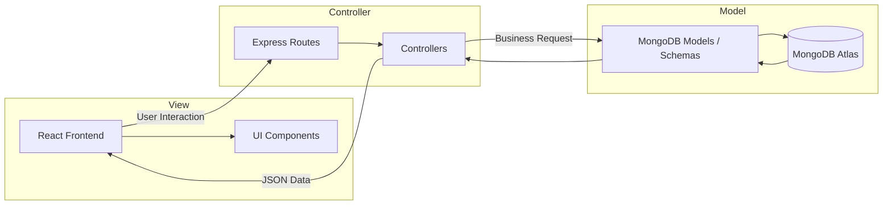
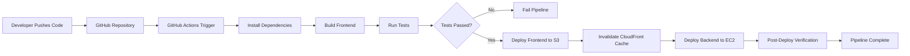

# MERN Stack AWS Architecture Diagrams

## 1. System Architecture Diagram

This diagram shows the end-to-end request path from the browser to the React frontend and backend API. It also highlights how the EC2-hosted API communicates with MongoDB Atlas for persistence.

## 2. Deployment Architecture Diagram

This deployment view clarifies hosting responsibilities across AWS services. It emphasizes static hosting on S3, content delivery via CloudFront, backend execution on EC2, and external database connectivity to MongoDB Atlas.

## 3. Data Flow Diagram - Level 0

This Level 0 DFD gives the highest-level view of how a user interacts with the system. It shows the application as a single process that exchanges data with the user and the database.

## 3. Data Flow Diagram - Level 1

This Level 1 DFD breaks the system into core processes: authentication, CRUD handling, API processing, and persistence. It is useful for academic evaluation because it shows functional decomposition and data movement clearly.

## 4. User Flowchart

This flowchart tracks the user journey from registration and login through dashboard usage and CRUD actions. It demonstrates how the UI supports a complete session lifecycle.

## 5. Backend Flowchart

This backend flowchart shows the request lifecycle from routing to database access and back to the client. It highlights separation of concerns through route, controller, service, model, and response layers.

## 6. Database Schema Diagram

This ER diagram outlines the main collections and relationships in the MongoDB schema. It shows how users, rooms, sessions, messages, transcripts, analytics, notifications, and schedules connect through references.

## 7. MVC Architecture Diagram

This MVC diagram separates presentation, request handling, and persistence. It makes the architecture easy to evaluate because the frontend, controllers, and database models are visually isolated.

## 8. CI/CD Pipeline Diagram

This CI/CD flow shows a standard GitHub Actions pipeline from code push to deployment. It demonstrates automated build, test, deployment, and cache invalidation for a production AWS release.
