# SpeakSpace — Full Project Documentation

> **SpeakSpace** is a real-time, AI-powered group discussion and communication coaching platform. Users join rooms, speak via WebRTC audio, receive live AI feedback from Gemini, and get a comprehensive end-of-session performance report.

---

## Table of Contents

1. [System Overview](#1-system-overview)
2. [Technology Stack](#2-technology-stack)
3. [High-Level Architecture](#3-high-level-architecture)
4. [Frontend Architecture](#4-frontend-architecture)
5. [Backend Architecture](#5-backend-architecture)
6. [Database Schema (MongoDB)](#6-database-schema-mongodb)
7. [REST API Reference](#7-rest-api-reference)
8. [Real-Time Socket Event Flow](#8-real-time-socket-event-flow)
9. [WebRTC Audio Pipeline](#9-webrtc-audio-pipeline)
10. [AI Integration Pipeline](#10-ai-integration-pipeline)
11. [Deployment & Infrastructure](#11-deployment--infrastructure)
12. [CI/CD Pipeline](#12-cicd-pipeline)
13. [End-to-End User Journey](#13-end-to-end-user-journey)

---

## 1. System Overview

SpeakSpace solves the problem of practicing Group Discussion (GD) skills in isolation. It provides:

- 🎤 **Real-time audio rooms** via WebRTC peer-to-peer connections
- 🤖 **Live AI coaching** — every spoken sentence is analyzed by Google Gemini for fluency, confidence and sentiment
- 📊 **Post-session reports** — full AI-generated participant scorecards exported as PDF
- 🏆 **Leaderboard & Analytics** — track improvement over time
- 🛡️ **Moderator tools** — mute/kick participants, manage speaking queue

---

## 2. Technology Stack

| Layer | Technology |
|---|---|
| **Frontend** | React 18, Vite, TailwindCSS, Zustand, Socket.IO Client, lucide-react |
| **Backend** | Node.js, Express.js, Socket.IO Server |
| **Database** | MongoDB via Mongoose ODM |
| **AI** | Google Gemini API (`@google/generative-ai`) — `gemini-flash-latest` model |
| **Auth** | JWT (jsonwebtoken), bcryptjs, Passport.js (Google OAuth) |
| **Real-time Audio** | WebRTC (browser-native), `getUserMedia` API |
| **Transcription** | Web Speech API (`SpeechRecognition`) — browser-native, continuous |
| **Infrastructure** | AWS EC2, Docker, Docker Compose, Nginx (reverse proxy + SSL) |
| **SSL** | Let's Encrypt via Certbot |
| **Monitoring** | Dozzle (Docker log viewer) |
| **CI/CD** | GitHub Actions |
| **Security** | Helmet, express-mongo-sanitize, express-rate-limit |

---

## 3. High-Level Architecture

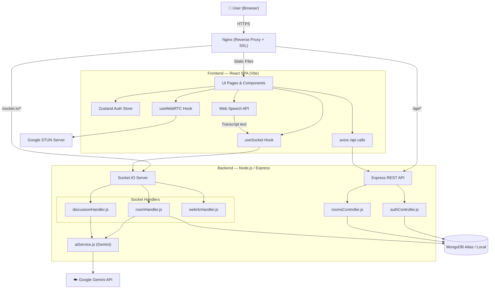

---

## 4. Frontend Architecture

### 4.1 Page & Routing Structure

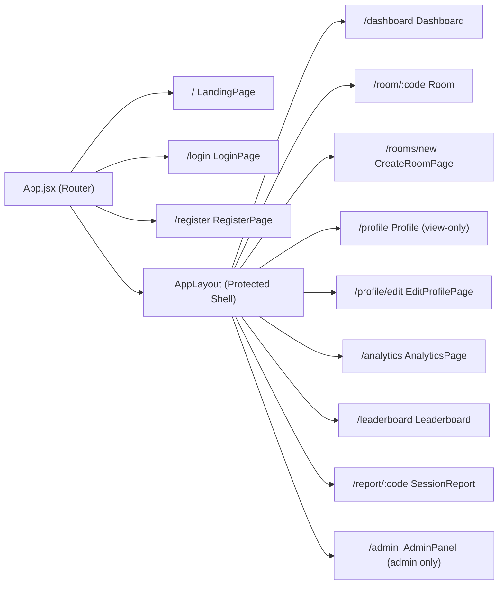

### 4.2 Frontend State Management

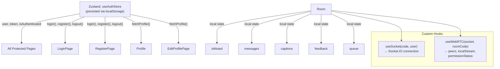

### 4.3 Room Component Data Flow

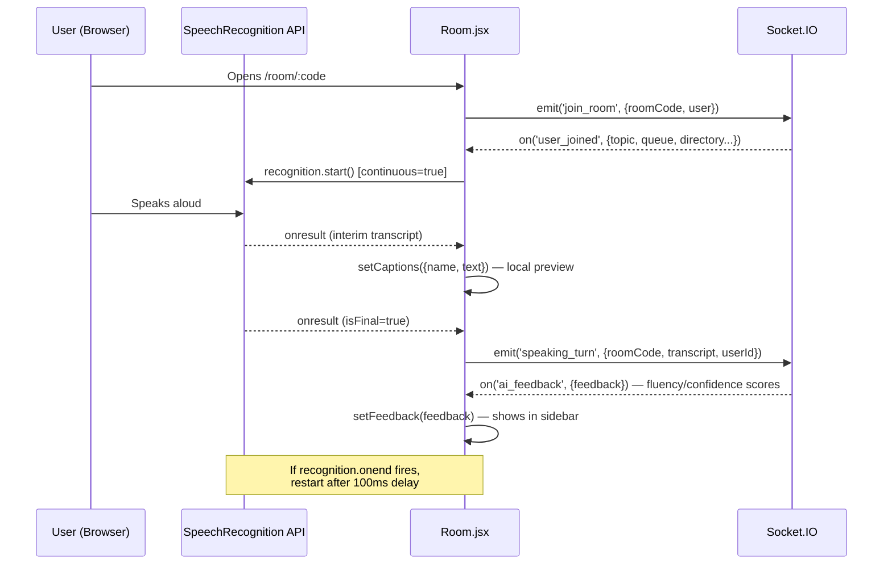

---

## 5. Backend Architecture

### 5.1 Backend Module Structure

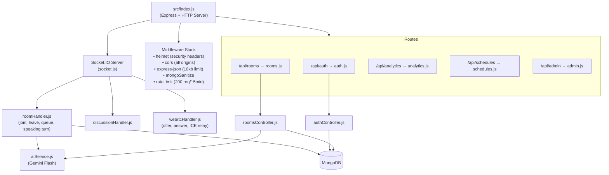

### 5.2 Authentication Flow

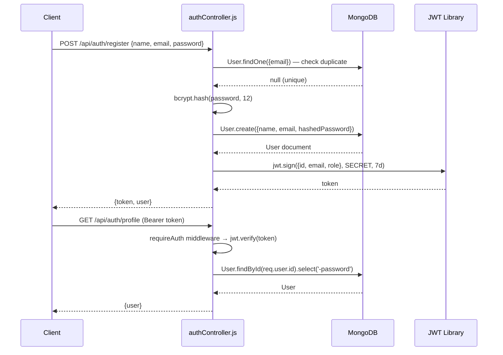

---

## 6. Database Schema (MongoDB)

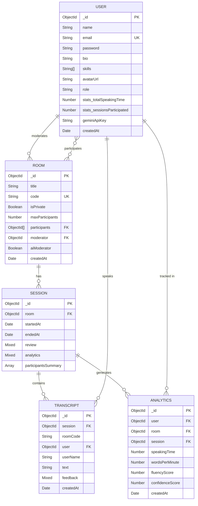

---

## 7. REST API Reference

| Method | Endpoint | Auth | Description |
|---|---|---|---|
| `POST` | `/api/auth/register` | ❌ | Register new user |
| `POST` | `/api/auth/login` | ❌ | Login, returns JWT |
| `GET` | `/api/auth/profile` | ✅ JWT | Get own profile |
| `PUT` | `/api/auth/profile` | ✅ JWT | Update name, bio, skills, avatar, geminiApiKey |
| `PUT` | `/api/auth/password` | ✅ JWT | Change password (verifies current first) |
| `POST` | `/api/auth/test-key` | ✅ JWT | Test a Gemini API key validity |
| `GET` | `/api/auth/google` | ❌ | Initiate Google OAuth |
| `POST` | `/api/rooms/create` | ✅ JWT | Create a new room |
| `GET` | `/api/rooms` | ✅ JWT | List all public rooms |
| `GET` | `/api/rooms/:code` | ✅ JWT | Get single room details |
| `GET` | `/api/rooms/:code/review` | ✅ JWT | Generate/fetch post-session AI review |
| `GET` | `/api/analytics/user` | ✅ JWT | Get user analytics |
| `GET` | `/api/analytics/room/:id` | ✅ JWT | Get room analytics |
| `GET` | `/api/schedules` | ✅ JWT | List schedules |
| `GET` | `/api/admin/users` | ✅ Admin | List all users |

---

## 8. Real-Time Socket Event Flow

### 8.1 Events Reference

| Direction | Event | Payload | Description |
|---|---|---|---|
| Client → Server | `join_room` | `{roomCode, user}` | User joins a room |
| Server → All | `user_joined` | `{user, socketId, directory, topic, queue, ...}` | Broadcast new joiner + full room state |
| Client → Server | `leave_room` | `{roomCode, user}` | User leaves |
| Server → All | `user_left` | `{socketId}` | Broadcast departure |
| Client → Server | `speaking_turn` | `{roomCode, transcript, userId}` | Finalized speech chunk |
| Server → Others | `speaking_turn` | `{userId, userName, transcript}` | Broadcast captions |
| Server → Speaker | `ai_feedback` | `{userId, feedback}` | Fluency/confidence scores |
| Client → Server | `raise_hand` | `{roomCode, userId, userName}` | Add to queue |
| Server → All | `queue_updated` | `[queue]` | Updated speaking queue |
| Client → Server | `next_speaker` | `{roomCode}` | Moderator advances queue |
| Server → All | `speaking_turn_start` | `{userId, userName}` | New active speaker |
| Client → Server | `mute_user` | `{roomCode, targetSocketId}` | Moderator mutes peer |
| Server → Target | `force_mute` | — | Silences target client |
| Client → Server | `kick_user` | `{roomCode, targetSocketId}` | Moderator kicks peer |
| Server → Target | `force_kick` | — | Redirects target to dashboard |

### 8.2 Room Lifecycle State Machine

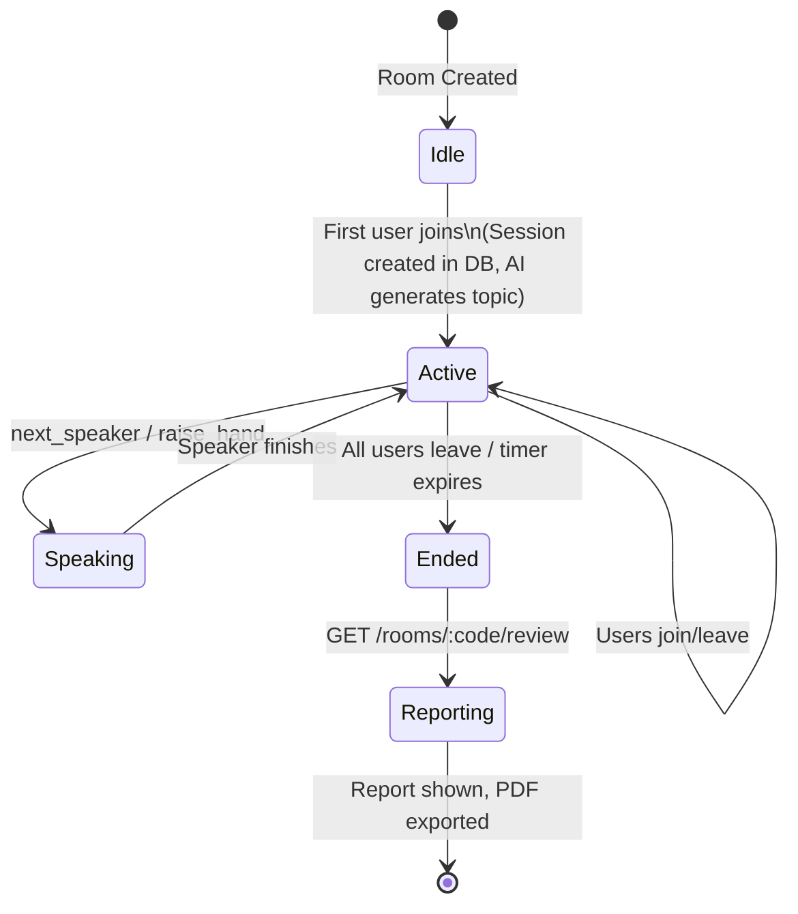

---

## 9. WebRTC Audio Pipeline

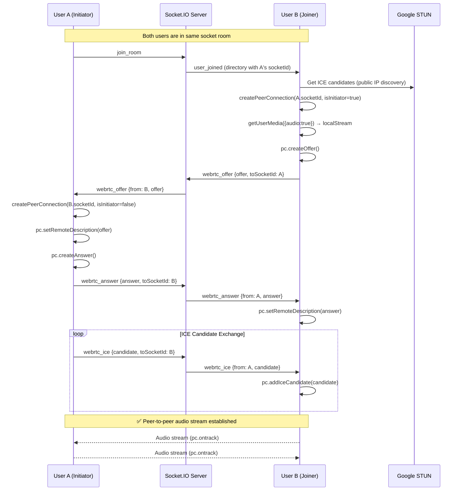

---

## 10. AI Integration Pipeline

### 10.1 Real-Time Speech Analysis (per utterance)

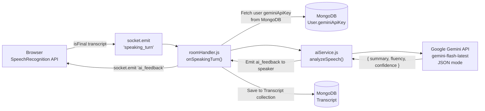

### 10.2 Post-Session Report Generation

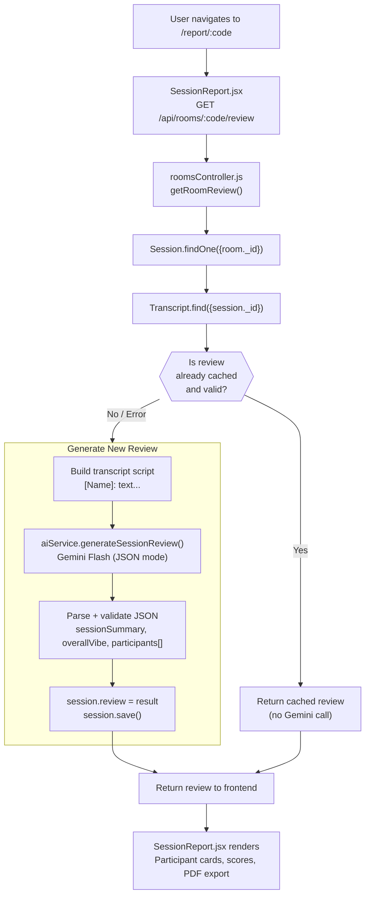

### 10.3 Gemini Response Schema

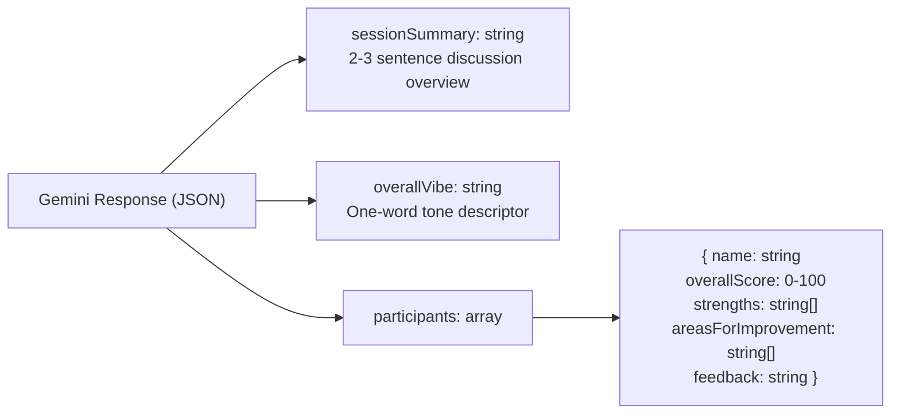

---

## 11. Deployment & Infrastructure

### 11.1 Docker Compose Services

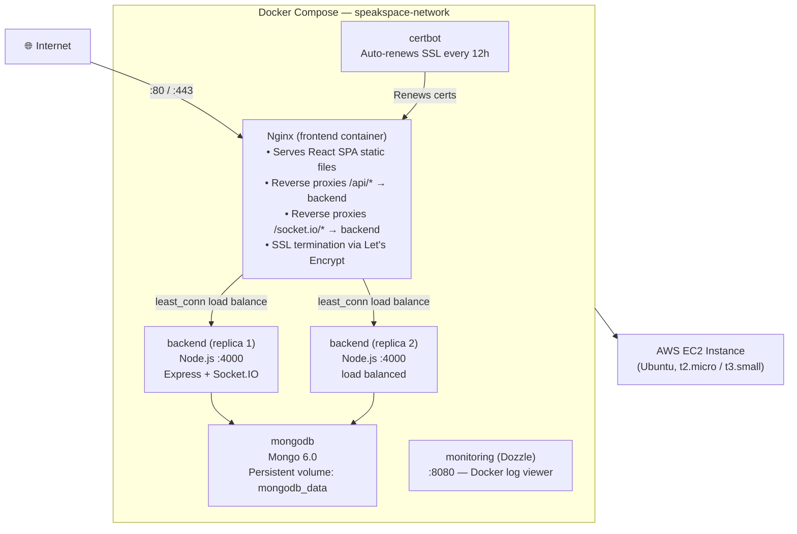

### 11.2 Nginx Routing Rules

| Path | Proxied To | Notes |
|---|---|---|
| `/.well-known/acme-challenge/` | Certbot webroot | Let's Encrypt challenge |
| `http://*` | `https://` redirect | Force HTTPS |
| `/api/*` | `http://speakspace_backend` | REST API upstream |
| `/socket.io/*` | `http://speakspace_backend` | WebSocket upgrade |
| `/*` | `/usr/share/nginx/html` | React SPA + `try_files /index.html` |

---

## 12. CI/CD Pipeline

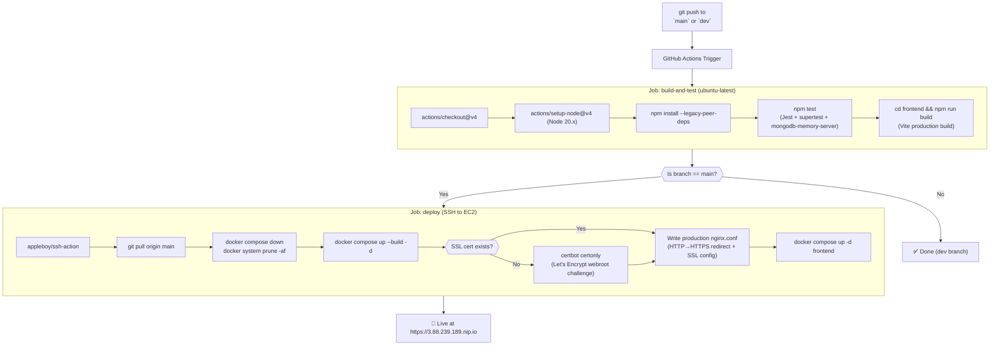

---

## 13. End-to-End User Journey

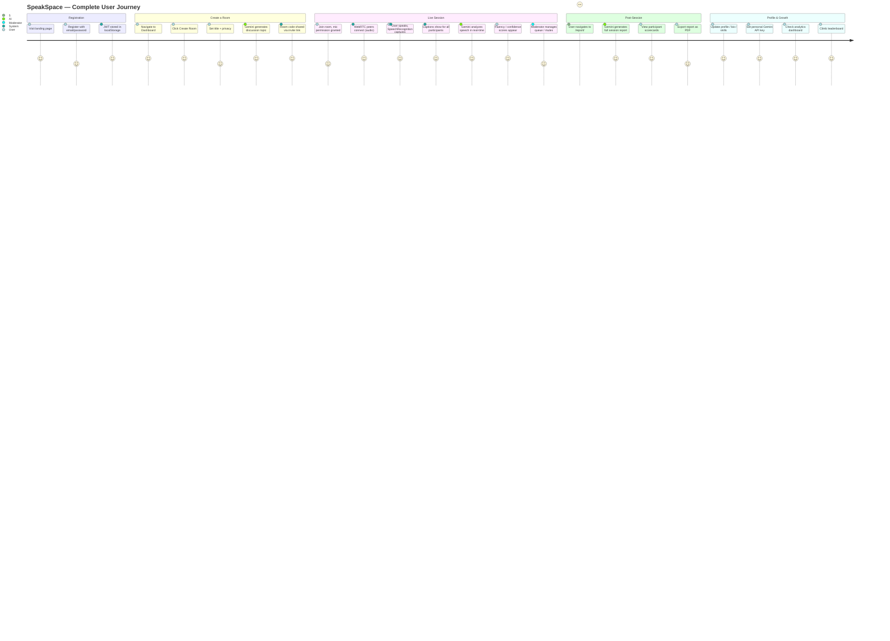

---

## Key Design Decisions

> [!NOTE]
> **WebRTC vs Server-side Audio**: Audio is transmitted peer-to-peer via WebRTC, not routed through the server. This massively reduces server bandwidth. The Socket.IO server only relays the signaling messages (offer/answer/ICE) to set up the P2P connection.

> [!NOTE]
> **SpeechRecognition for Transcripts**: The browser's built-in `Web Speech API` (Chrome-based) is used for transcription instead of a paid transcription service. It runs entirely on-device and sends only final text to the server.

> [!TIP]
> **Gemini Key Hierarchy**: Each user can optionally save their own Gemini API key in their profile. When a session uses AI features, it first checks the moderator's personal key, then falls back to the platform's environment variable key (`GEMINI_API_KEY`).

> [!IMPORTANT]
> **Transcript Auto-Deletion**: Transcript documents have a MongoDB TTL index of **24 hours** (`expires: 86400`). Once the session review is generated and cached in the `Session.review` field, the raw transcripts are no longer needed and are automatically cleaned up.

> [!WARNING]
> **Single Region Deployment**: Currently deployed to a single AWS EC2 instance. While Docker Compose runs 2 backend replicas, both are on the same physical machine. For production scale, move to ECS/EKS or add multiple EC2s with a load balancer.
