# SpeakSpace — System Design & Technical Documentation

> SpeakSpace is a real-time, AI-assisted communication training platform that enables users to participate in structured group discussions, receive live AI-based evaluation, and review detailed post-session analytics.

---

## Table of Contents

1. [System Overview](#1-system-overview)
2. [Technology Stack](#2-technology-stack)
3. [High-Level Architecture](#3-high-level-architecture)
4. [Frontend Architecture](#4-frontend-architecture)
5. [Backend Architecture](#5-backend-architecture)
6. [Database Schema](#6-database-schema)
7. [REST API Reference](#7-rest-api-reference)
8. [Real-Time Socket Event Flow](#8-real-time-socket-event-flow)
9. [WebRTC Audio Pipeline](#9-webrtc-audio-pipeline)
10. [AI Integration Pipeline](#10-ai-integration-pipeline)
11. [Deployment and Infrastructure](#11-deployment-and-infrastructure)
12. [CI/CD Pipeline](#12-cicd-pipeline)
13. [End-to-End User Journey](#13-end-to-end-user-journey)
14. [Key Design Decisions](#14-key-design-decisions)

---

## 1. System Overview

SpeakSpace addresses the lack of accessible, real-time group discussion (GD) practice environments by combining low-latency peer-to-peer audio communication, on-device speech transcription, AI-driven feedback, and persistent analytics into a single integrated platform.

### Functional Capabilities

- Real-time voice-based discussion rooms using WebRTC peer-to-peer connections
- Continuous speech transcription using the browser-native Web Speech API
- Live AI evaluation of fluency, confidence, and sentiment via Google Gemini
- Automated post-session participant scorecards with PDF export
- Leaderboard and historical analytics for longitudinal performance tracking
- Moderation controls including mute, kick, and speaking queue management
- Secure password recovery flow with one-time reset tokens

---

## 2. Technology Stack

The system follows a full JavaScript architecture with clearly separated responsibilities across the client, server, and AI service layers.

| Layer | Technology | Rationale |
|---|---|---|
| Frontend | React 18, Vite, TailwindCSS | High-performance SPA with fast build times |
| State Management | Zustand | Lightweight global state with localStorage persistence |
| Backend | Node.js, Express.js | Event-driven, scalable API server |
| Real-Time Layer | Socket.IO | Bi-directional event communication |
| Database | MongoDB, Mongoose | Flexible schema for session and analytics data |
| AI Engine | Google Gemini API (`gemini-flash-latest`) | Low-latency inference for real-time speech analysis |
| Audio Transport | WebRTC | Peer-to-peer streaming, avoids server-side media load |
| Transcription | Web Speech API | On-device speech-to-text, no external service needed |
| Authentication | JWT, bcryptjs, Passport.js | Stateless, scalable auth with optional Google OAuth |
| Infrastructure | AWS EC2, Docker, Docker Compose, Nginx | Containerized deployment with reverse proxy and SSL |
| CI/CD | GitHub Actions | Automated build, test, and zero-touch deployment |
| Security | Helmet, express-mongo-sanitize, express-rate-limit | Defense against injection, abuse, and header attacks |

---

## 3. High-Level Architecture

The system is structured into three primary layers: a client layer that handles UI and audio, a server layer that coordinates signaling and API requests, and external services for AI inference and database storage.

A key architectural principle is that audio streams are transmitted directly between clients using WebRTC. The backend only relays signaling messages (offer, answer, ICE candidates) to establish the peer connection. This eliminates server-side media processing, significantly reducing bandwidth and infrastructure cost.

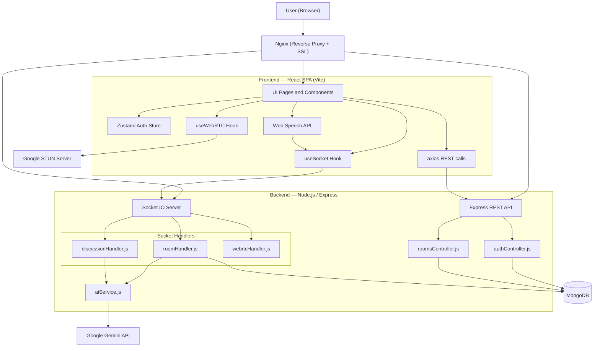

---

## 4. Frontend Architecture

The frontend is a Single Page Application built with React and Vite. It is divided into public routes accessible without authentication, and protected routes that require a valid JWT stored in localStorage.

### 4.1 Page and Routing Structure

All protected pages are wrapped inside an `AppLayout` component that enforces authentication via the `ProtectedRoute` wrapper and provides the shared navigation shell.

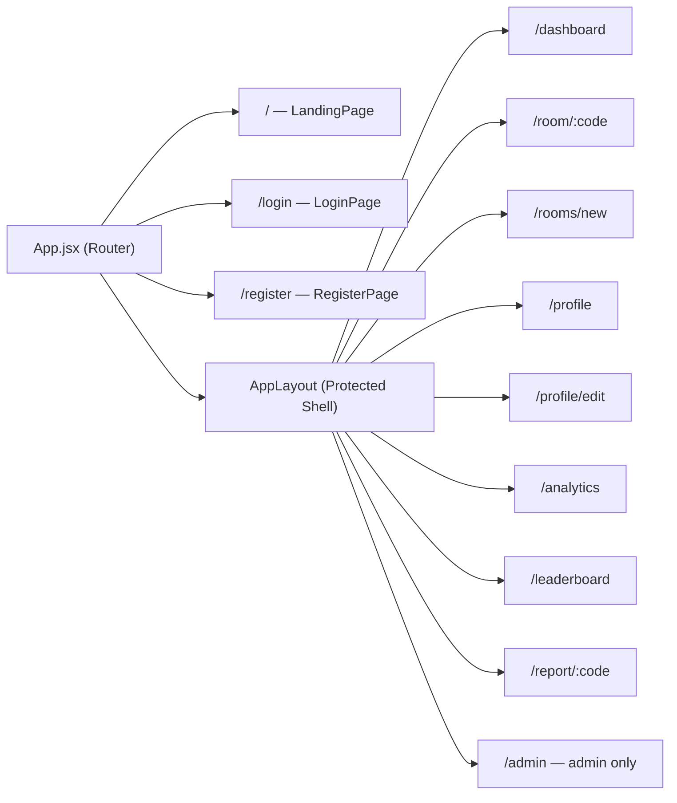

### 4.2 State Management

Global state is managed via Zustand and persisted to `localStorage` so that users remain authenticated across page refreshes. Transient room-level state (mute status, captions, speaking queue, AI feedback) is maintained in local React state within the `Room` component.

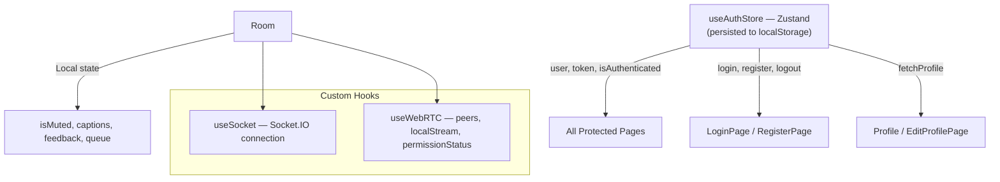

### 4.3 Room Component Data Flow

When a user opens a room, the frontend establishes a socket connection, requests microphone access, and starts continuous speech recognition. Each finalized speech segment is emitted to the backend, which triggers AI analysis and returns feedback in real time.

The speech recognition session is restarted automatically with a 100ms delay if the browser stops it unexpectedly — a common behavior in Chrome during natural speech pauses.

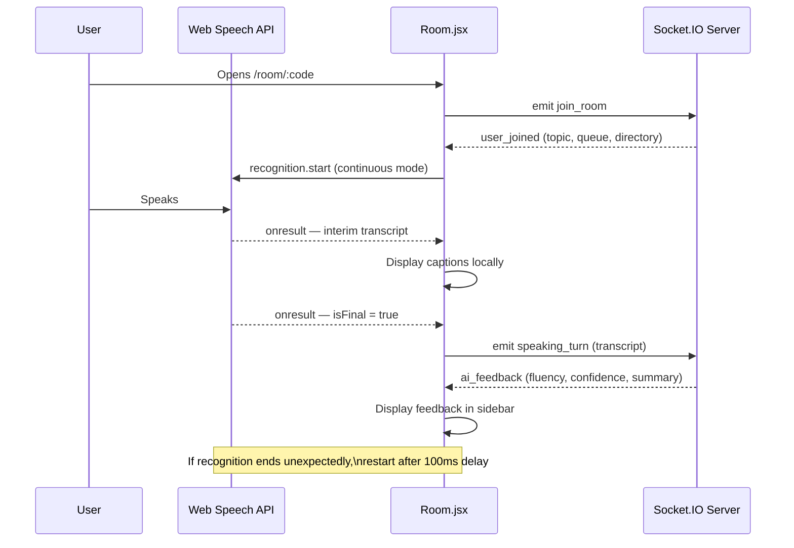

---

## 5. Backend Architecture

The backend is organized into distinct modules. Each concern — routing, business logic, real-time events, AI processing — is handled by a dedicated file. This separation makes the codebase maintainable and testable independently.

### 5.1 Module Structure

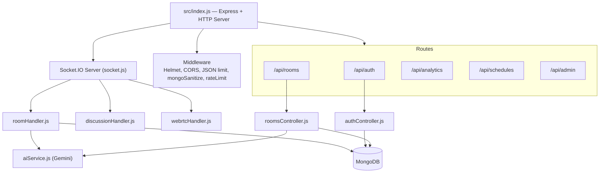

### 5.2 Authentication Flow

Registration and login are handled via REST endpoints. Passwords are hashed using bcrypt with a cost factor of 12. On successful authentication, a JWT is issued with a 7-day expiry. All protected routes validate this token using the `requireAuth` middleware before processing the request.

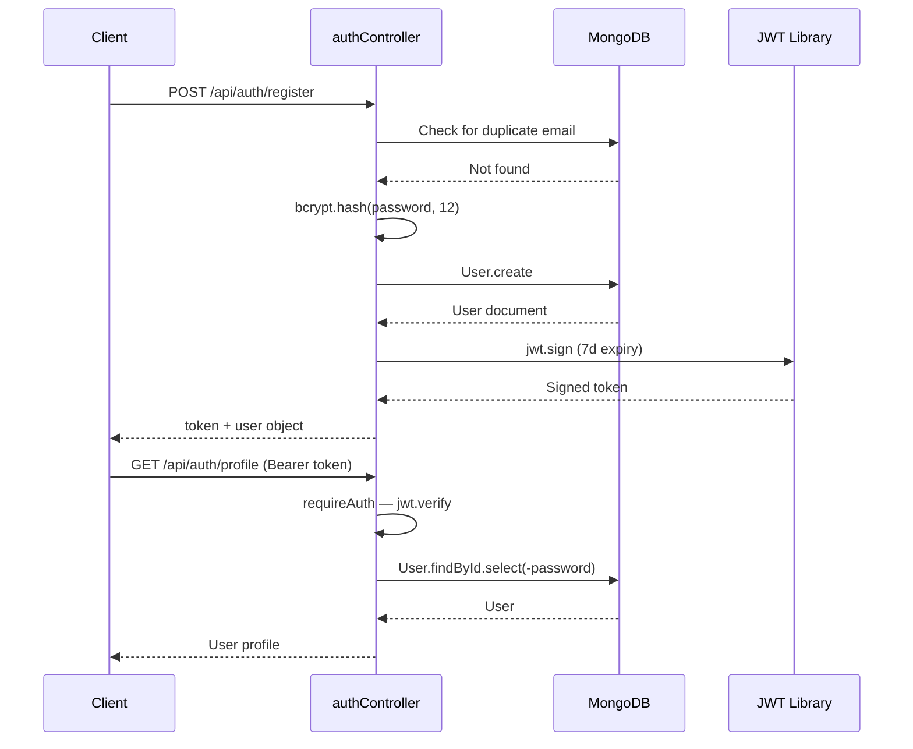

---

## 6. Database Schema

MongoDB is used for all persistence. The schema is designed to separate concerns: users, rooms, sessions, transcripts, and analytics are independent collections linked by ObjectId references.

Transcripts are ephemeral — they carry a TTL index of 24 hours. Once the AI-generated session review is cached in the `Session.review` field, the raw transcript data is no longer needed and is automatically purged.

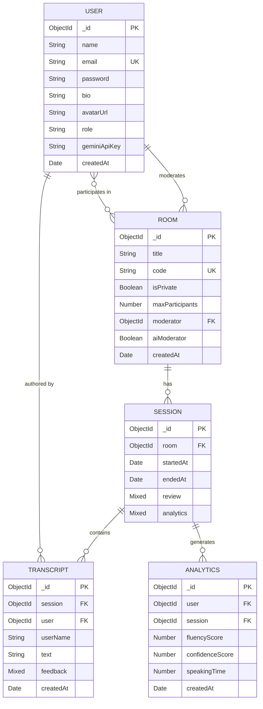

---

## 7. REST API Reference

All protected endpoints require a `Bearer` JWT in the `Authorization` header. Admin-only endpoints additionally verify the `role` field on the decoded token.

| Method | Endpoint | Auth | Description |
|---|---|---|---|
| POST | /api/auth/register | None | Register a new user |
| POST | /api/auth/login | None | Authenticate and receive JWT |
| GET | /api/auth/profile | JWT | Retrieve own profile |
| PUT | /api/auth/profile | JWT | Update name, bio, skills, avatar, API key |
| PUT | /api/auth/password | JWT | Change password (requires current password) |
| POST | /api/auth/test-key | JWT | Validate a Gemini API key |
| POST | /api/auth/forgot-password | None | Request a password reset link |
| POST | /api/auth/reset-password | None | Reset password using a valid token |
| GET | /api/auth/google | None | Initiate Google OAuth flow |
| POST | /api/rooms/create | JWT | Create a new discussion room |
| GET | /api/rooms | JWT | List all public rooms |
| GET | /api/rooms/:code | JWT | Get details for a specific room |
| GET | /api/rooms/:code/review | JWT | Retrieve or generate post-session AI report |
| GET | /api/analytics/user | JWT | Get performance analytics for the current user |
| GET | /api/analytics/room/:id | JWT | Get analytics for a specific room |
| GET | /api/schedules | JWT | List scheduled sessions |
| GET | /api/admin/users | Admin | List all registered users |

---

## 8. Real-Time Socket Event Flow

Socket.IO is used for all real-time communication between the client and server. The server maintains the authoritative state for each active room (queue, active speaker, session ID) and broadcasts updates to all participants when state changes occur.

### 8.1 Events Reference

| Direction | Event | Payload | Description |
|---|---|---|---|
| Client to Server | join_room | roomCode, user | User joins a room |
| Server to All | user_joined | user, socketId, directory, topic, queue | Broadcast new participant and full room state |
| Client to Server | leave_room | roomCode, user | User leaves |
| Server to All | user_left | socketId | Broadcast departure |
| Client to Server | speaking_turn | roomCode, transcript, userId | Finalized speech sent for AI processing |
| Server to Others | speaking_turn | userId, userName, transcript | Broadcast captions to all other participants |
| Server to Speaker | ai_feedback | userId, feedback | Return AI evaluation to the speaker |
| Client to Server | raise_hand | roomCode, userId, userName | Add user to speaking queue |
| Server to All | queue_updated | queue array | Updated speaking queue |
| Client to Server | next_speaker | roomCode | Moderator advances the queue |
| Server to All | speaking_turn_start | userId, userName | Announce the new active speaker |
| Client to Server | kick_user | roomCode, targetSocketId | Moderator removes a participant |
| Server to Target | force_kick | none | Redirects the target to the dashboard |
| Client to Server | end_session | roomCode | Moderator finalizes session and triggers AI report |
| Server to All | session_ended | sessionId | Broadcast session completion and redirect to report |
| Client to Server | toggle_mute | roomCode, isMuted | User broadcasts their mute state to everyone |
| Server to All | mute_state_changed | socketId, isMuted | Syncs mute status across all participant cards |

### 8.2 Room Lifecycle State Machine

A room transitions through states from creation to report generation. When the first user joins, a session document is created in MongoDB and Gemini generates a discussion topic. The room remains active while participants are present. After all users leave or the timer expires, the session ends and a review can be requested.

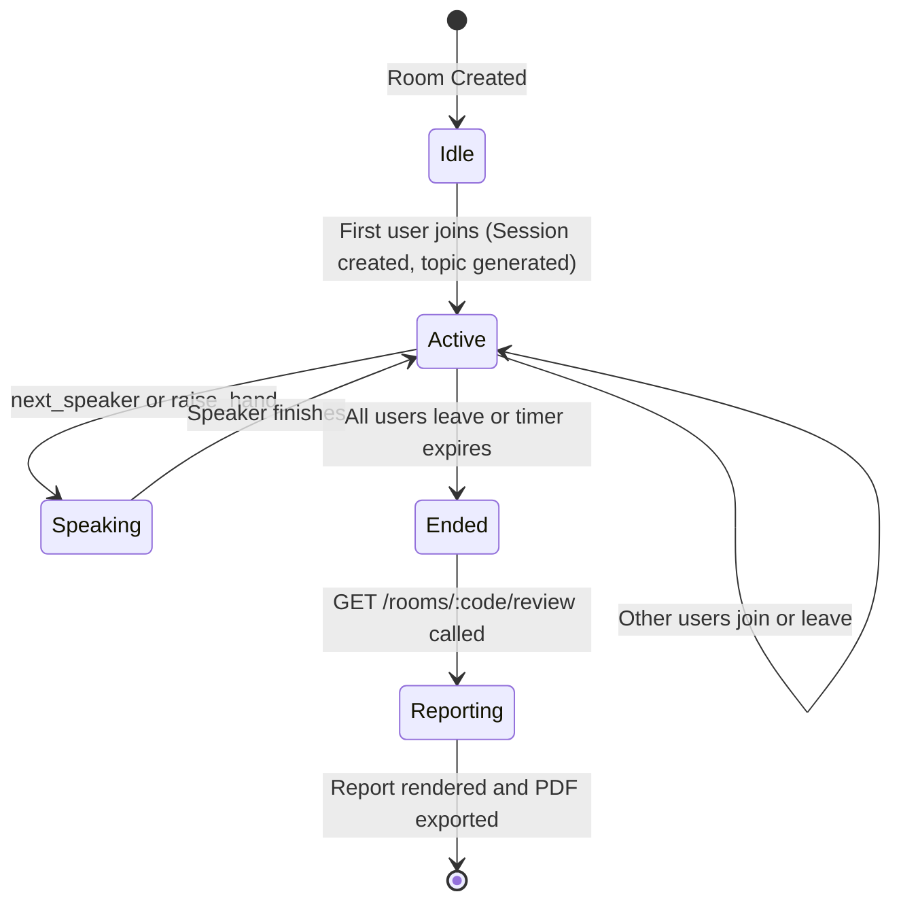

---

## 9. WebRTC Audio Pipeline

WebRTC enables peer-to-peer audio transmission without routing media through the server. The Socket.IO server acts purely as a signaling relay for the initial connection setup. Once the connection is established, audio flows directly between clients.

### Connection Establishment Process

1. User A joins the room and emits `join_room`
2. When User B joins, the server broadcasts the room directory to all participants
3. User B discovers User A's socket ID and initiates a peer connection
4. User B creates an SDP offer and emits it via Socket.IO to User A
5. User A responds with an SDP answer
6. ICE candidates are exchanged until a valid network path is found
7. Audio streams begin flowing directly between peers
8. **Identity-Based Stabilization**: Peers are tracked by User ID to ensure that if a connection flickers, "ghost" sessions are automatically cleaned up and a fresh handshake is established.
9. **Manual Fail-safe**: A "Fix Audio" mechanism allows users to manually re-trigger the handshake if browser autoplay policies or network shifts cause silence.

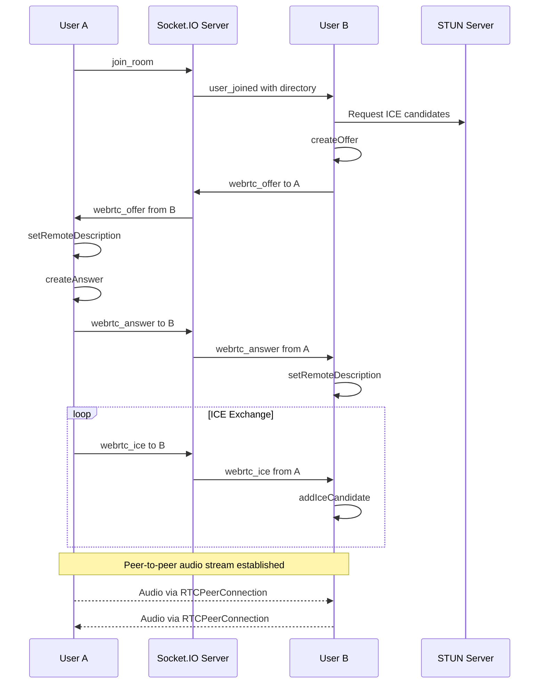

---

## 10. AI Integration Pipeline

AI processing is handled by `aiService.js`, which wraps the Google Gemini API. The service supports per-user API keys, allowing the moderator's stored key to be used preferentially, with a platform-level fallback key when no personal key is configured.

### 10.1 Real-Time Speech Analysis

Each time a user finishes a sentence (when `isFinal = true` in the SpeechRecognition result), the transcript is emitted to the backend. The backend retrieves the speaker's Gemini API key from MongoDB, calls Gemini for analysis, emits the result back to the speaker, and saves the transcript for the session report.

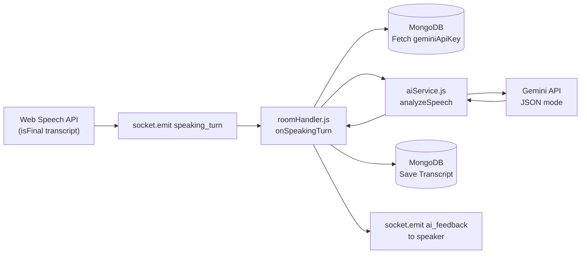

### 10.2 Post-Session Report Generation

When a user navigates to `/report/:code`, the frontend calls `GET /api/rooms/:code/review`. The backend looks up the latest session, retrieves all transcripts, and sends them to Gemini for a structured analysis. The result is cached in `session.review` so that subsequent requests do not trigger redundant AI calls.

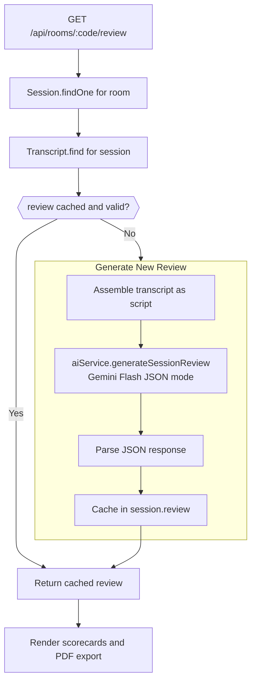

### 10.3 Gemini Response Structure

The session review response from Gemini follows a strict JSON schema:

- `sessionSummary` — A 2 to 3 sentence narrative summary of the discussion
- `overallVibe` — A single word or phrase describing the session tone
- `participants` — An array where each entry contains:
  - `name` — Participant name as identified from transcripts
  - `overallScore` — Integer score from 0 to 100
  - `strengths` — Array of observed communication strengths
  - `areasForImprovement` — Array of suggested improvement areas
  - `feedback` — One personalized coaching sentence

---

## 11. Deployment and Infrastructure

### 11.1 Docker Compose Services

The application is deployed as a multi-container Docker Compose stack on a single AWS EC2 instance. All services communicate over an internal Docker network named `speakspace-network`.

| Service | Image | Role |
|---|---|---|
| mongodb | mongo:6.0 | Persistent database with named volume |
| backend | Custom (./Dockerfile) | Node.js API and Socket.IO, 2 replicas |
| frontend | Custom (./frontend/Dockerfile) | Nginx serving React SPA and proxying API |
| certbot | certbot/certbot | Automatic TLS certificate renewal every 12 hours |
| monitoring | amir20/dozzle | Docker log viewer on port 8080 |

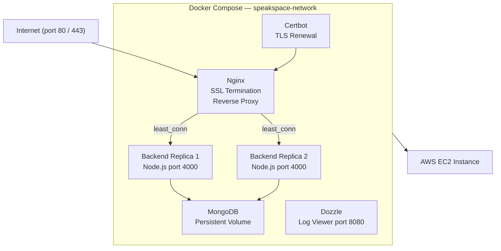

### 11.2 Nginx Routing Configuration

Nginx handles all inbound traffic and routes requests based on path prefix.

| Path | Destination | Purpose |
|---|---|---|
| /.well-known/acme-challenge/ | Certbot webroot | TLS certificate issuance |
| http://* | https:// redirect | Force encrypted connections |
| /api/* | Backend upstream | REST API proxy |
| /socket.io/* | Backend upstream | WebSocket upgrade proxy |
| /* | /usr/share/nginx/html | React SPA with SPA fallback to index.html |

---

## 12. CI/CD Pipeline

SpeakSpace uses GitHub Actions for automated continuous integration and deployment. Every push to any branch triggers the build and test job. The deployment job runs only when changes are pushed to the `main` branch.

### 12.1 Branch Strategy

| Branch | Trigger | Jobs Run |
|---|---|---|
| dev | Push or PR | build-and-test only |
| main | Push (merged PR or hotfix) | build-and-test then deploy |
| PR to main | Pull Request open | build-and-test as a merge gate |

### 12.2 Pipeline Overview

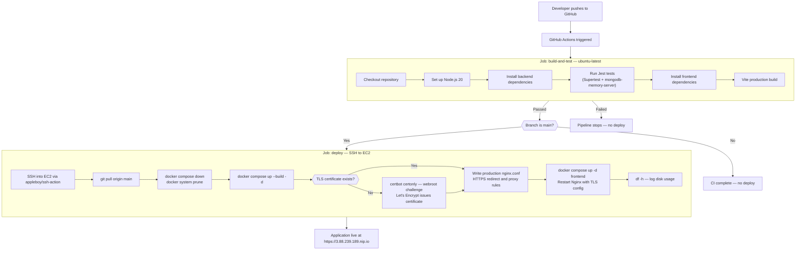

### 12.3 Deploy Process on EC2 (Step-by-Step)

When the deploy job runs, it SSHs into the EC2 instance and executes the following sequence:

1. The latest code is pulled from the `main` branch
2. All running containers are stopped and old images are removed to ensure a clean build
3. Docker Compose rebuilds all images and starts all five services
4. If a TLS certificate does not yet exist, Certbot performs the ACME webroot challenge with Let's Encrypt
5. A production-ready `nginx.conf` is written with HTTPS enforcement and upstream proxy rules
6. The frontend (Nginx) container is restarted to apply the new configuration

### 12.4 Required GitHub Secrets

| Secret Name | Used In | Purpose |
|---|---|---|
| EC2_HOST | deploy job | IP or hostname of the EC2 instance |
| EC2_SSH_KEY | deploy job | Private SSH key (PEM) for the ubuntu user |
| VITE_API_URL | build-and-test | API base URL injected at frontend build time |

### 12.5 Automated Test Suite

Tests run against an in-memory MongoDB instance provided by `mongodb-memory-server`, which means no real database connection is required in CI.

| Component | Role |
|---|---|
| Jest | Test runner and assertion library |
| Supertest | HTTP request simulation against Express app |
| mongodb-memory-server | In-process MongoDB for isolated test runs |

---

## 13. End-to-End User Journey

The following describes the complete lifecycle of a user from registration through session completion.

**Step 1 — Registration**: The user creates an account using email and password. A JWT is issued and stored in localStorage for subsequent authenticated requests. **Password Recovery**: Users can securely reset their credentials via an email-based token flow if they lose access.

**Step 2 — Room Creation**: The user navigates to the dashboard and creates a discussion room. Gemini generates a relevant discussion topic automatically based on the room seed.

**Step 3 — Session**: Participants join via the room code or invite link. WebRTC establishes direct audio connections between peers. As each participant speaks, transcripts are sent to the backend and AI feedback is returned within seconds.

**Step 4 — Moderation**: The room moderator can manage the speaking queue, advance to the next speaker, and mute or remove participants if needed.

**Step 5 — Report**: After leaving, the user navigates to the session report page. Gemini aggregates all transcripts and produces participant-level scorecards. The report can be exported as a PDF.

**Step 6 — Growth**: Performance scores contribute to the leaderboard and analytics dashboard, enabling users to track improvement over time.

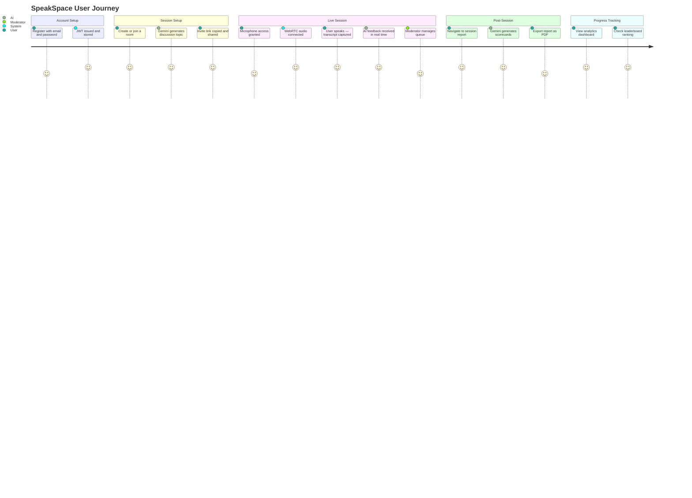

---

## 14. Key Design Decisions

### WebRTC for Audio Transport
Audio is transmitted peer-to-peer using WebRTC rather than being routed through the server. This design eliminates server-side media processing, reducing bandwidth requirements and improving scalability without additional infrastructure cost.

### On-Device Transcription
The browser's native Web Speech API is used for speech-to-text conversion. This avoids the cost and latency of external transcription services. Only the finalized text is sent to the server; raw audio never leaves the client.

### User-Level API Key Strategy
Each user can configure a personal Google Gemini API key in their profile settings. The system prioritizes the moderator's key when processing a session, and falls back to the platform-level `GEMINI_API_KEY` environment variable. This distributes API usage and allows advanced users to use higher-quota keys.

### Ephemeral Transcript Storage
Transcript documents are stored with a MongoDB TTL index of 24 hours and are automatically deleted after expiry. Once the session review is generated and cached in the `Session.review` field, the raw transcripts are redundant. This minimizes storage consumption and aligns with data minimization principles.

### Cached Session Reviews
The AI-generated session review is stored directly on the `Session` document after the first generation. Subsequent requests for the same report are served from the database without calling Gemini again. The cache is invalidated only if the stored review is missing or contains an error response.

### Single-Region Deployment Trade-off
The current deployment runs all services on a single AWS EC2 instance. While Docker Compose provides two backend replicas, both run on the same physical host, which introduces a single point of failure. For production-grade scaling, this should be migrated to a multi-node setup using AWS ECS, EKS, or multiple EC2 instances behind an Application Load Balancer with a managed MongoDB Atlas cluster.

