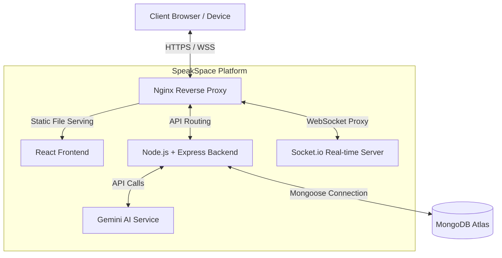
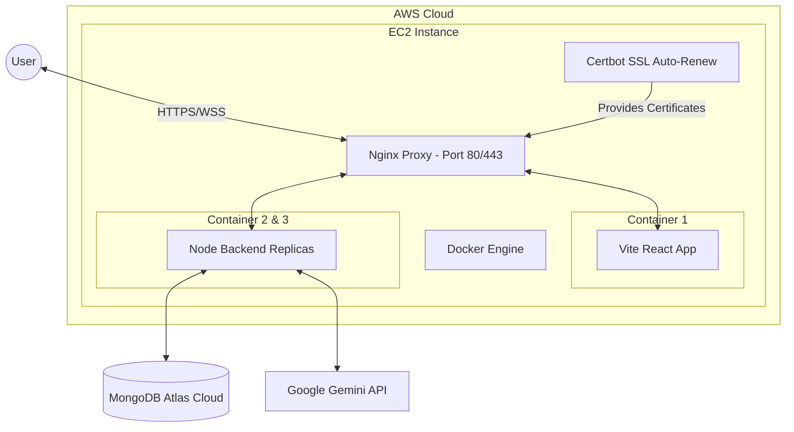
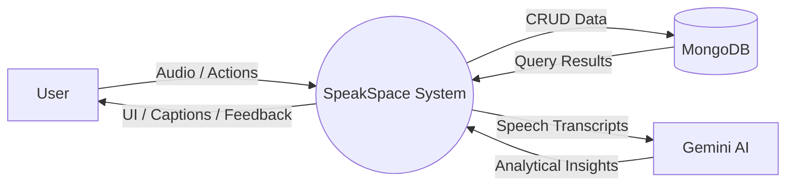
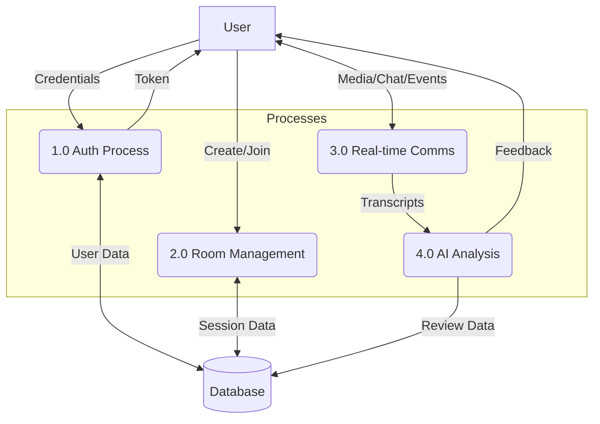
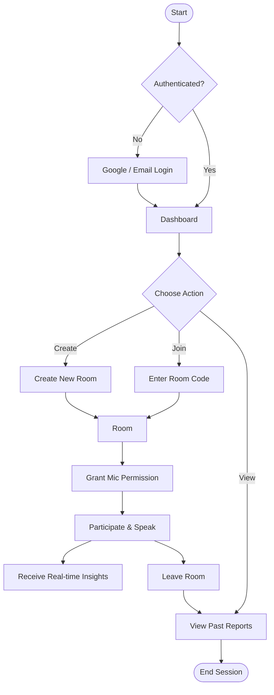
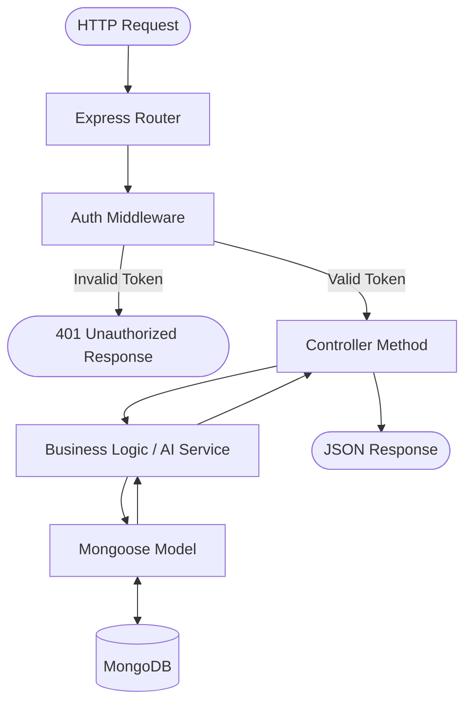
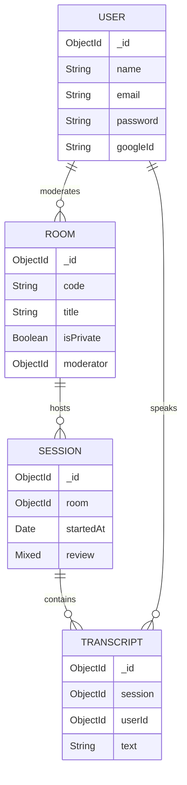
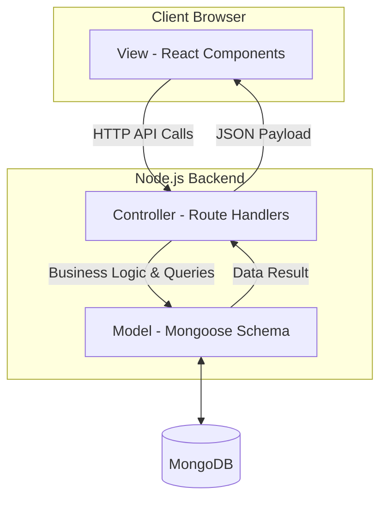

# SpeakSpace System Architecture Diagrams

Below are the architecture diagrams and flowcharts for the SpeakSpace MERN stack application, specifically tailored to your current AWS Dockerized deployment and WebRTC/AI capabilities.

## 1. System Architecture Diagram

This diagram shows the high-level interaction between the client, the Nginx reverse proxy, the frontend/backend services, and external integrations (MongoDB and Gemini AI).

* **Explanation:** The client connects securely via Nginx, which routes static file requests to the React build and API/WebSocket requests to the Node.js backend. The backend manages database operations and requests AI analysis from Google Gemini.*

---

## 2. Deployment Architecture (AWS)

Visualizes the actual hosting infrastructure on AWS, utilizing a single EC2 instance running multiple Docker containers for seamless scaling and SSL management.

* **Explanation:** The entire stack is containerized on an AWS EC2 instance. Nginx handles load-balancing between backend replicas and encrypts traffic using certificates generated dynamically by the Certbot container.*

---

## 3. Data Flow Diagram (DFD)

### Level 0 (Context Diagram)

### Level 1 (Process Diagram)

* **Explanation:** Data flows from the user into authentication, room creation, and real-time WebRTC connections. Speech is transcribed and sent to the AI process, which stores reports in the database and returns insights to the user.*

---

## 4. User Flowchart

The step-by-step journey a user takes when interacting with the SpeakSpace application.

* **Explanation:** Users authenticate and navigate to the dashboard where they can create/join rooms or view past performance. Inside a room, they grant hardware permissions, speak, receive feedback, and eventually view a comprehensive report upon leaving.*

---

## 5. Backend Flowchart

The lifecycle of an HTTP API request as it travels through the Express backend architecture.

* **Explanation:** Incoming requests are routed and authenticated via middleware. Valid requests pass to controllers, which utilize services and models to interact with the database before returning a JSON response.*

---

## 6. Database Schema Diagram (ERD)

The core MongoDB collections and how they reference one another via ObjectIds.

* **Explanation:** A User can moderate multiple Rooms. A Room hosts multiple temporal Sessions. A Session contains multiple Transcripts, which are linked to the specific User who spoke the text.*

---

## 7. MVC Architecture Diagram

How the separation of concerns is managed between the frontend and backend.

* **Explanation:** The React frontend acts as the View layer. It makes API calls to the Express Controllers, which act as the middleman to read/write data using Mongoose Models.*

---

## 8. CI/CD Pipeline Diagram (GitHub Actions)

The automated deployment pipeline triggered via GitHub Actions.

```mermaid
graph LR
    Dev((Developer)) -->|Push Code| GH[GitHub Repository]
    GH -->|Trigger Workflow| GA[GitHub Actions]
    
    subgraph CI Pipeline
        Build[Install Dependencies]
        Test[Run Backend Tests]
        Pack[Build Vite Frontend]
    end
    
    GA --> Build --> Test --> Pack
    Pack -->|SSH Deploy Action| EC2[AWS EC2 Server]
    
    subgraph CD Execution
        Pull[Git Pull main]
        Down[Docker Compose Down]
        Up[Docker Compose Up --build]
        Cert[Certbot SSL Provision]
    end
    
    EC2 --> Pull --> Down --> Up --> Cert
```

* **Explanation:** Pushing code triggers a GitHub Action that tests the backend and builds the frontend. It then SSHs into the EC2 instance, pulls the latest code, rebuilds the Docker containers, and ensures SSL certificates are valid.*
